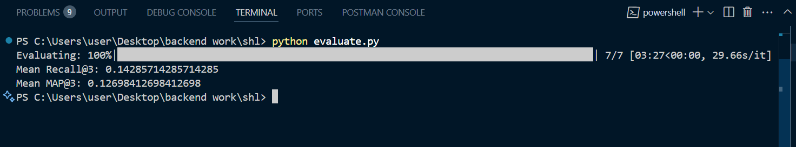

# SHL Assessment Recommendation System

The SHL Assessment Recommendation System is an intelligent backend service designed to recommend SHL assessments based on job descriptions or queries. It uses a Retrieval-Augmented Generation (RAG) approach with FAISS for retrieval and Groq-powered LLMs for generating personalized assessment recommendations. The backend is implemented using FastAPI and includes endpoints for health checking and recommendations.

## Features

- **Health Check Endpoint**: `/health` – A simple endpoint to check if the backend is running.
- **Recommendation Endpoint**: `/recommend` – Accepts job descriptions or queries and returns the most relevant SHL assessments.
- **FAISS-based Retrieval**: Efficient retrieval of relevant assessments based on the query.
- **LLM-based Recommendations**: Uses Groq’s Mistral-Saba 24b model to refine the recommendations based on job descriptions.

## Prerequisites

Before getting started, ensure you have the following:

- Python 3.8 or higher
- FastAPI
- Uvicorn (for running the FastAPI app)
- FAISS (CPU or GPU version, depending on your hardware)
- Sentence-Transformers
- Groq API Key (for interacting with the Groq LLM)

## Installation

1. **Clone the repository**:
    ```bash
    git clone https://github.com/Ayush56565/shl-assessment-recommendation.git
    cd shl-assessment-recommendation
    ```

2. **Create a virtual environment**:
    ```bash
    python3 -m venv venv
    source venv/bin/activate  # On Windows: venv\Scripts\activate
    ```

3. **Install the required dependencies**:
    ```bash
    pip install -r requirements.txt
    ```

4. **Set up your environment variables**:
    - Create a `.env` file in the root directory and add your **Groq API Key**:
      ```
      GROQ_API_KEY=your-groq-api-key
      ```

5. **Prepare the data**:
    - Make sure you have the following files available in the `data/` folder:
      - `index.faiss` – The FAISS index file for fast retrieval.
      - `scraped_data.json` – A JSON file containing the SHL assessment data.

## Running the Application

1. **Start the FastAPI server**:
    You can run the FastAPI application locally using Uvicorn:
    ```bash
    uvicorn main:app --reload
    ```

    The app will be available at `http://localhost:8000`.

2. **Access the health check endpoint**:
    To verify that the app is running, you can visit:
    ```
    http://localhost:8000/health
    ```
    This should return a JSON response:
    ```json
    {
      "status": "healthy"
    }
    ```

3. **Make recommendations**:
    To get recommendations, send a POST request to the `/recommend` endpoint with a job description or query. Here's an example using `curl`:
    ```bash
    curl -X 'POST' \
      'http://localhost:8000/recommend' \
      -H 'Content-Type: application/json' \
      -d '{
        "query": "Looking for a cognitive ability test for a software engineer"
      }'
    ```

    Example Response:
    ```json
    {
      "recommended_assessments": [
        {
          "url": "http://example.com/assessment1",
          "adaptive_support": "Yes",
          "description": "A cognitive ability test for engineers.",
          "duration": 60,
          "remote_support": "Yes",
          "test_type": ["Cognitive", "Technical"]
        },
        ...
      ]
    }
    ```

## Deployment

To deploy the app on a server, follow these steps:

1. **Install dependencies**:
    On the server, ensure that you have Python 3.8+ installed, and then install the dependencies:
    ```bash
    pip install -r requirements.txt
    ```

2. **Upload necessary files**:
    - `index.faiss`
    - `scraped_data.json`
    - Your app files (e.g., `main.py`, `recommender.py`)

3. **Run the FastAPI application**:
    Use Uvicorn to run the app in production:
    ```bash
    uvicorn main:app --host 0.0.0.0 --port 8000
    ```

## Evaluation

Evaluated using a benchmark dataset of real-world job queries mapped to SHL assessments.
- Metrics:
  -  Mean Average Precision at 3 (MAP@3) : 0.12698412698412698
  -  Mean Recall at 3 (Recall@3) : 0.14285714285714285

These metrics measure how often the correct assessments appear in the top 3 results and their ranking quality.

## Notes

- Ensure your **Groq API key** is correctly set in the `.env` file.
- If you need to update the FAISS index or the scraped data, replace the respective files (`index.faiss` and `scraped_data.json`) in the `data/` folder.

## Contributing

Feel free to fork the repository and submit pull requests. If you encounter any bugs or have suggestions for improvements, please open an issue.

